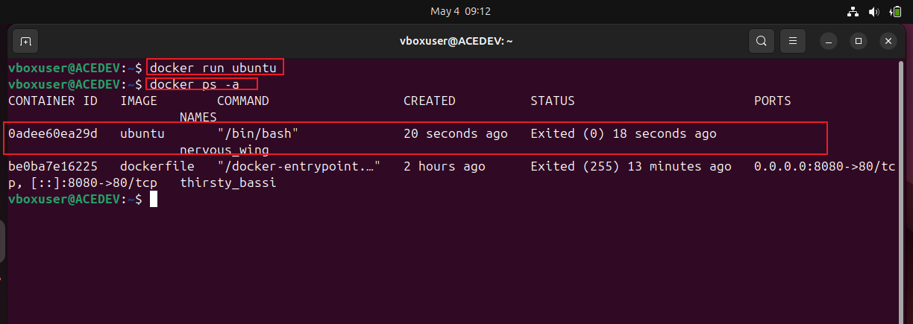
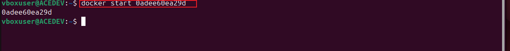
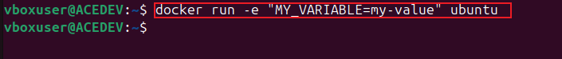
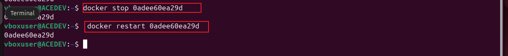
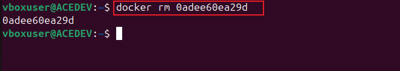

# Docker-containers
The project focuses on hands-on learning with Docker containers, a key aspect of cloud computing and Devops

* Launching and running containers: Using Docker commands to create and start containers "docker run ubuntu" and "docker ps -a" to list all containers

start the container "ubuntu"
      
      docker start 

* Customizing container behavior: Setting environment variables, mapping ports, and mounting volumes.
   
      docker run -e "MY_VARIABLE=my-value" ubuntu

* Managing container lifecycle: Starting, stopping, restarting, and removing containers.
      docker start 

     docker stop 
     docker restart

  
      
      docker remove

The project helps build foundational skills for deploying and managing containerized applications efficiently